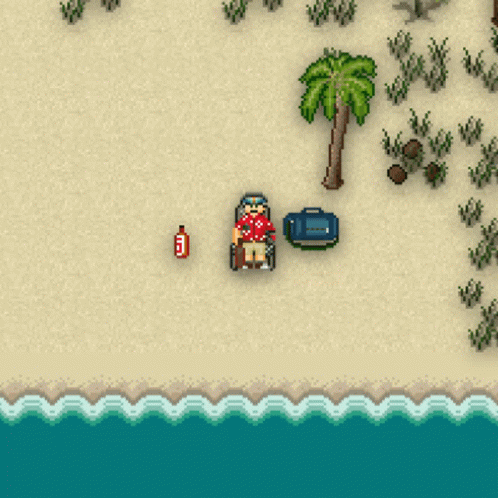

## 💽 What do I do? / 💽 Чим я займаюся?
🇺🇸 ENG:\
Greetings! I'm - Alex, amateur in linguistics and programming.\
I've took part in translation of these projects: (listed below UA version)\
🇺🇦 UA:\
Вітаю! Я - Шурік, лінгвіст-аматор та програміст-аматор.\
Перекладаю(ав) такі проекти як:
- [Hypixel](https://hypixel.net/)
- [TicketBot](https://ticketsbot.net/)
- [Frontier Station 14](https://github.com/Iced-Coded/frontier-station-14)
- [Big Ambitions](https://store.steampowered.com/app/1331550/Big_Ambitions/)
- [Vintage Story Wiki](https://wiki.vintagestory.at/index.php/Special:Contributions/Alexiex)
- та інші

Зараз я не працюю над жодними проектами.

## 📊 Stats / 📊 Статистика

## 📞 How to contact me? / 📞 Як зв'язатися зі мною?
- EMail: [alexvolkov@envs.net](mailto:alexvolkov@envs.net)
- Bluesky: [avol.pp.ua](https://bsky.app/profile/avol.pp.ua)
